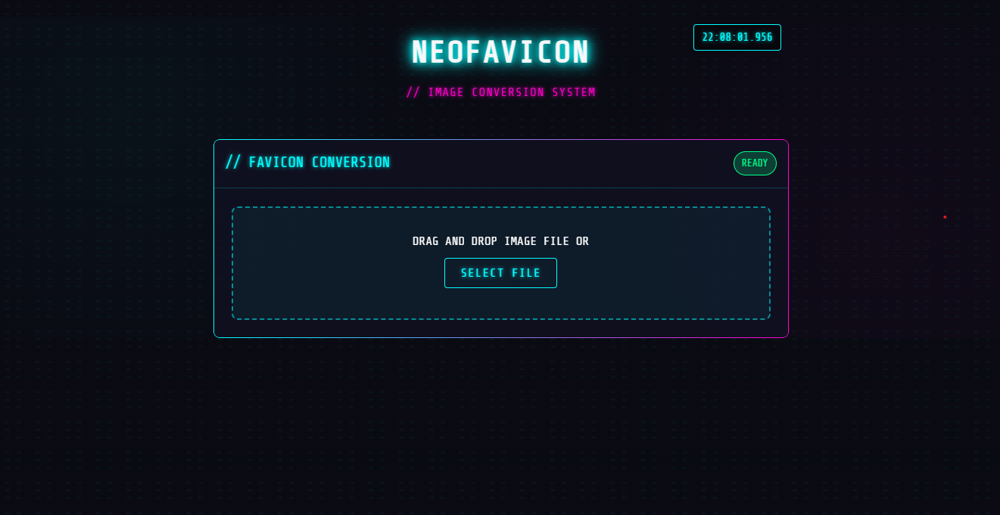

# NEOFAVICON // IMAGE CONVERSION SYSTEM

<div align="center">
  


**A cyberpunk-themed microservice for converting images to favicons**

[](https://nodejs.org)
[](https://docker.com)
[](https://kubernetes.io)

</div>

## // SYSTEM OVERVIEW

NEOFAVICON is a standalone microservice that converts any image file into optimized favicon formats. Built with a cyberpunk aesthetic, it provides a visually striking and functional UI for image conversion.

```
█▀▀▀▀▀▀▀▀▀▀▀▀▀▀▀▀▀▀▀▀▀▀▀▀▀▀▀▀▀▀▀▀▀▀▀▀▀▀▀▀▀▀▀▀▀▀▀▀▀▀▀▀▀▀▀▀▀▀▀▀▀▀▀▀▀▀▀▀█
█                                                                      █
█   ▄▄▄▄▄▄▄  ▄▄▄▄▄▄▄  ▄▄▄▄▄▄▄       ▄▄▄▄▄▄█                           █
█   █       █       █       █      █      █                           █
█   █    ▄▄▄█▄     ▄█   ▄   █      █▄     █                           █
█   █   █▄▄▄  █   █ █  █▄█  █       █▄▄▄▄▄█                           █
█   █    ▄▄▄█ █   █ █       █      █      █                           █
█   █   █▄▄▄  █   █ █   ▄   █      █      █                           █
█   █▄▄▄▄▄▄▄█ █▄▄▄█ █▄▄█ █▄▄█      █▄▄▄▄▄▄█                           █
█                                                                      █
█              IMAGE CONVERSION MICROSERVICE                           █
█                                                                      █
█▄▄▄▄▄▄▄▄▄▄▄▄▄▄▄▄▄▄▄▄▄▄▄▄▄▄▄▄▄▄▄▄▄▄▄▄▄▄▄▄▄▄▄▄▄▄▄▄▄▄▄▄▄▄▄▄▄▄▄▄▄▄▄▄▄▄▄▄█
```

## // FEATURES

- **Multi-format Output**: Generates `.ico` (16x16) and `.png` files (32x32, 48x48, 64x64)
- **Drag & Drop Interface**: Intuitive UI with cyberpunk styling
- **Real-time Processing**: Visual feedback during conversion
- **Self-contained**: Runs as a standalone service, Docker container, or in Kubernetes
- **Responsive Design**: Works on mobile and desktop devices
- **Secure**: Strict file validation and sanitization

## // SYSTEM REQUIREMENTS

- Node.js 18+
- 512MB RAM minimum
- 1GB disk space
- Network connectivity

## // CONFIGURATION OPTIONS

The system can be configured via environment variables:

| Variable | Default | Description |
|----------|---------|-------------|
| `PORT` | `3000` | HTTP port for the server |
| `NODE_ENV` | `development` | Environment (`development` or `production`) |
| `LOG_LEVEL` | `info` | Logging level (`debug`, `info`, `warn`, `error`) |
| `MAX_FILE_SIZE` | `10485760` | Maximum upload size in bytes (10MB) |

## // API REFERENCE

### Convert an image to favicon

**Endpoint**: `POST /convert`

**Content-Type**: `multipart/form-data`

**Parameters**:
- `image`: The image file to convert (required)

**Response**:
```json
{
  "success": true,
  "status": "SUCCESS",
  "message": "Favicon generated successfully",
  "conversionId": "1647852369123-a1b2c3d4",
  "timestamp": "2025-03-28T12:34:56.789Z",
  "originalFile": {
    "name": "logo.png",
    "type": "image/png",
    "size": 24680,
    "dimensions": {
      "width": 512,
      "height": 512
    }
  },
  "output": {
    "ico": {
      "path": "/output/favicon-1647852369123-a1b2c3d4.ico",
      "size": "16x16",
      "format": "ICO"
    },
    "additional": [
      {
        "path": "/output/favicon-32x32-1647852369123-a1b2c3d4.png",
        "size": "32x32",
        "format": "PNG"
      },
      {
        "path": "/output/favicon-48x48-1647852369123-a1b2c3d4.png",
        "size": "48x48",
        "format": "PNG"
      },
      {
        "path": "/output/favicon-64x64-1647852369123-a1b2c3d4.png",
        "size": "64x64",
        "format": "PNG"
      }
    ]
  },
  "system": {
    "processingTime": 235,
    "version": "1.0.0"
  }
}
```


## // ARCHITECTURE

```
┌─────────────────────┐      ┌─────────────────┐      ┌─────────────────┐
│                     │      │                 │      │                 │
│    Client Browser   │─────▶│  Express Server │─────▶│   Sharp Image   │
│                     │      │                 │      │   Processing    │
└─────────────────────┘      └─────────────────┘      └─────────────────┘
                                      │                        │
                                      ▼                        ▼
                             ┌─────────────────┐      ┌─────────────────┐
                             │                 │      │                 │
                             │  File Storage   │◀─────│  Image Output   │
                             │                 │      │                 │
                             └─────────────────┘      └─────────────────┘
```

## // LICENSE

MIT License

Copyright (c) 2025 NEOFAVICON SYSTEM